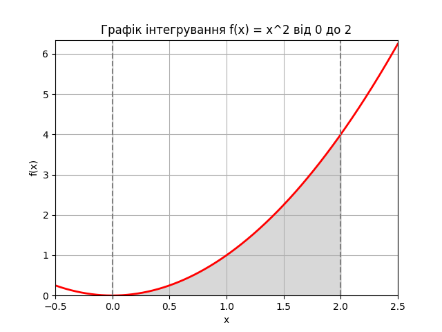

# Лінійне програмування та рандомізовані алгоритми

Вітаємо чемпіонів в останньому домашньому завданні! 💪🏼 🎉

Як було вже зазначено, лінійне програмування (ЛП) широко застосовується у багатьох галузях індустрії та науки завдяки його практичності та ефективності. Оскільки розв’язання задач ЛП дозволяє оптимізувати логістичні та виробничі процеси, компанії використовують його для мінімізації витрат на транспортування та максимізації виробництва, враховуючи різноманітні обмеження.

Тому сьогодні ви зануритеся у світ оптимізації виробництва, де обмежені ресурси впливають на прийняття рішень. Ви використаєте бібліотеку PuLP для створення математичної моделі, яка допоможе вам максимізувати виробництво продуктів, дотримуючись визначених обмежень.

Метод Монте-Карло також є дуже практичним інструментом, особливо у сфері обчислень та імітації. Коли точні аналітичні обчислення можуть бути важкими або навіть неможливими, метод Монте-Карло є ефективним інструментом для отримання приблизних результатів. Тому сьогодні ви потренуєтесь знаходити значення інтеграла, використовуючи метод Монте-Карло.

Таким чином, домашнє завдання буде складатися з двох незалежних завдань.

## Опис домашнього завдання

### Завдання 1. Оптимізація виробництва

Компанія виробляє два види напоїв: "Лимонад" і "Фруктовий сік". Для виробництва цих напоїв використовуються різні інгредієнти та обмежена кількість обладнання. Задача полягає у максимізації виробництва, враховуючи обмежені ресурси.

### Умови завдання:

1. "Лимонад" виготовляється з "Води", "Цукру" та "Лимонного соку".
2. "Фруктовий сік" виготовляється з "Фруктового пюре" та "Води".
3. Обмеження ресурсів: 100 од. "Води", 50 од. "Цукру", 30 од. "Лимонного соку" та 40 од. "Фруктового пюре".
4. Виробництво одиниці "Лимонаду" вимагає 2 од. "Води", 1 од. "Цукру" та 1 од. "Лимонного соку".
5. Виробництво одиниці "Фруктового соку" вимагає 2 од. "Фруктового пюре" та 1 од. "Води".

Використовуючи PuLP, створіть модель, яка визначає, скільки "Лимонаду" та "Фруктового соку" потрібно виробити для максимізації загальної кількості продуктів, дотримуючись обмежень на ресурси. Напишіть програму, код якої максимізує загальну кількість вироблених продуктів "Лимонад" та "Фруктовий сік", враховуючи обмеження на кількість ресурсів.

### Завдання 2. Обчислення визначеного інтеграла.

Ваше друге завдання полягає в обчисленні значення інтеграла функції методом Монте-Карло.

> [!NOTE]
> INFO
>
> 📖 Можете обрати функцію на власний розсуд.

Виконаємо побудову графіка.

✂️ Це можна запустити!

```python
import matplotlib.pyplot as plt
import numpy as np

# Визначення функції та межі інтегрування

def f(x):
return x ** 2

a = 0 # Нижня межа
b = 2 # Верхня межа

# Створення діапазону значень для x

x = np.linspace(-0.5, 2.5, 400)
y = f(x)

# Створення графіка

fig, ax = plt.subplots()

# Малювання функції

ax.plot(x, y, 'r', linewidth=2)

# Заповнення області під кривою

ix = np.linspace(a, b)
iy = f(ix)
ax.fill_between(ix, iy, color='gray', alpha=0.3)

# Налаштування графіка

ax.set_xlim([x[0], x[-1]])
ax.set_ylim([0, max(y) + 0.1])
ax.set_xlabel('x')
ax.set_ylabel('f(x)')

# Додавання меж інтегрування та назви графіка

ax.axvline(x=a, color='gray', linestyle='--')
ax.axvline(x=b, color='gray', linestyle='--')
ax.set_title('Графік інтегрування f(x) = x^2 від ' + str(a) + ' до ' + str(b))
plt.grid()
plt.show()
```

Отримаємо наступний результат.



1. Обчисліть значення інтеграла функції за допомогою методу Монте-Карло, інакше кажучи, знайдіть площу під цим графіком (сіра зона).
2. Перевірте правильність розрахунків, щоб підтвердити точність методу Монте-Карло, шляхом порівняння отриманого результату та аналітичних розрахунків або результату виконання функції `quad`. Зробіть висновки.

> [!NOTE]
> INFO
>
> 📖 Для перевірки обчислення визначеного інтеграла в Python ви можете використовувати бібліотеку SciPy, зокрема її функцію quad з підмодуля integrate. Спочатку необхідно визначити функцію, яку ви хочете інтегрувати, а потім використати quad для обчислення інтеграла на заданому інтервалі.

Приклад застосування функції quad

✂️ Це можна запустити!

```python
import scipy.integrate as spi

# Визначте функцію, яку потрібно інтегрувати, наприклад, f(x) = x^2

def f(x):
return x**2

# Визначте межі інтегрування, наприклад, від 0 до 1

a = 0 # нижня межа
b = 2 # верхня межа

# Обчислення інтеграла

result, error = spi.quad(f, a, b)

print("Інтеграл: ", result)
```

У цьому прикладі, функція quad повертає два значення: результат інтегрування та оцінку абсолютної помилки.

Виведення:

```python
Інтеграл: 2.666666666666667 2.960594732333751e-14
```

## Підготовка та завантаження домашнього завдання

1. Створіть публічний репозиторій `goit-algo-hw-10`.
2. Виконайте завдання та відправте його у свій репозиторій.
3. Завантажте робочі файли на свій комп’ютер та прикріпіть їх у `LMS` у форматі `zip`. Назва архіву повинна бути у форматі `ДЗ10_ПІБ`.
4. Прикріпіть посилання на репозиторій `goit-algo-hw-10` та відправте на перевірку.

## Формат здачі

Прикріплені файли репозиторію у форматі `zip` з назвою `ДЗ10_ПІБ`.
Посилання на репозиторій.

## Критерії прийняття ДЗ

Прикріплені посилання на репозиторій `goit-algo-hw-10` та безпосередньо самі файли репозиторію у форматі `zip`.

### Завдання 1:

Код виконується і повертає максимальну можливу загальну кількість вироблених продуктів "Лимонад" та "Фруктовий сік", враховуючи обмеження на кількість ресурсів.

### Завдання 2:

Програмно реалізовано алгоритм пошуку визначеного інтеграла за допомогою методу Монте-Карло. Код виконується та повертає значення інтеграла.

Виконано порівняльний аналіз результату, отриманого за допомогою алгоритму, з результатом, отриманим аналітично або за допомогою функції quad з підмодуля `integrate` бібліотеки `SciPy`.

Зроблено висновки щодо правильності розрахунків шляхом порівняння отриманих результатів і результатів, які дає функція quad або аналітичне обчислення інтеграла. Висновки оформлено у вигляді файлу `readme.md` домашнього завдання.

## Формат оцінювання

Оцінка від 0 до 100.
Завдання 1 оцінюється в 40 балів.
Завдання 2 оцінюється в 60 балів.

---

### Завдання 1 - оптимізація виробництва

#### Результати Розв'язання:

- Кількість лимонаду: 30.0 одиниць
- Кількість фруктового соку: 20.0 одиниць
- Загальна кількість продуктів: 50.0 одиниць

#### Висновки:

- Кількість лимонаду: 30.0 одиниць — це максимальна кількість лимонаду, яку можна виробити з доступними ресурсами.
- Кількість фруктового соку: 20.0 одиниць — це максимальна кількість фруктового соку, яку можна виробити з доступними ресурсами.
- Загальна кількість продуктів: 50.0 одиниць — це максимальна кількість продукції (лимонаду і фруктового соку) разом, яку можна виробити при даних обмеженнях.

---

### Завдання 2 - обчислення визначеного інтеграла

#### Результати Розв'язання:

- Числовий інтеграл: 2.6666666666666665 (з помилкою 2.9605947323337504e-14)
- Monte Carlo інтеграл (100 точок): 2.24
- Monte Carlo інтеграл (1000 точок): 2.544
- Monte Carlo інтеграл (10000 точок): 2.7216
- Monte Carlo інтеграл (100000 точок): 2.6616
- Monte Carlo інтеграл (1000000 точок): 2.666224

#### Висновки:

- Як видно з результатів, оцінка інтеграла методом Монте-Карло наближається до точного значення зі збільшенням кількості точок. Це очікуваний результат, оскільки точність методу Монте-Карло зростає при збільшенні числа випадкових точок.
- Для малого числа точок (100 та 1000) результати значно відрізняються від точного значення. Однак, при збільшенні числа точок до 10000 і більше, результати стають ближчими до точного значення.
- Найбільш точні результати отримані для 1000000 і 10000000 точок, де оцінка інтеграла дуже близька до точного значення 2.6666666666666665.
- Таким чином, метод Монте-Карло є ефективним інструментом для наближеного обчислення інтегралів, особливо коли аналітичне обчислення є складним або неможливим. Однак, функція quad з бібліотеки SciPy забезпечує більш точний результат з оцінкою абсолютної помилки.
